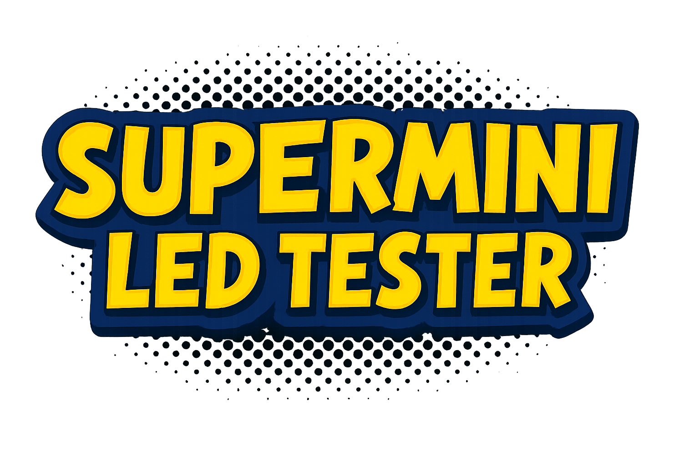
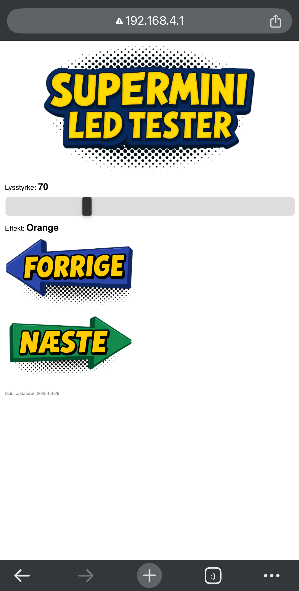
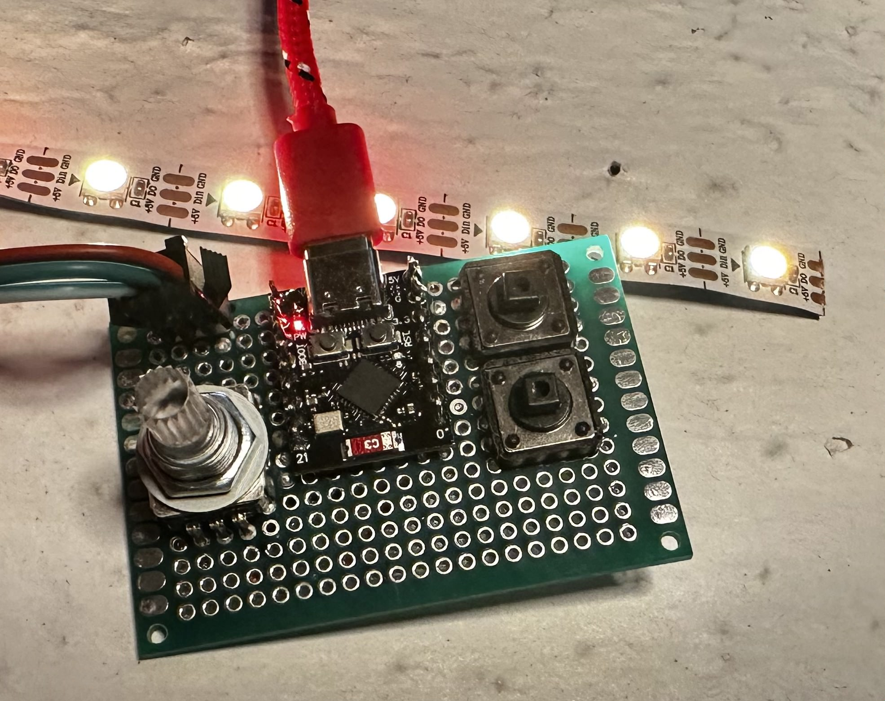

# SuperMini LED Tester - SPIFFS & WebSocket version

Dette projekt bruger et ESP32-C3 Mini Dev Board til at styre en WS2812B LED-strip med både fysiske kontakter og et webinterface. Det kombinerer rotary encoder, EEPROM-lagring, SPIFFS-hostet webside og realtidskommunikation med WebSockets.

---

## 🔖 Releases

Tidligere versioner af dette projekt findes nu som officielle [GitHub releases](https://github.com/dkingger/LEDstrip-tester/releases).  
Der finder du:
- ZIP-filer med kildekode
- Beskrivelser af funktioner
- Versioner som `Encode_LED`, `Encode_LED_Web`, osv.

---

## Funktioner

- 🔄 **Rotary encoder** justerer lysstyrken (0–255)
- 🔘 **To ringtryk** skifter mellem 10 forskellige effekter
- 💡 **WS2812B LED-strip** med 10 adresserbare LEDs
- 🌍 **WiFi Access Point** med Captive Portal-funktion
- 📁 **SPIFFS**: HTML-side og billeder hostes direkte fra ESP32'en
- 🔌 **WebSocket-forbindelse** sender opdateringer i realtid til webinterfacet
- 💾 **EEPROM** gemmer lysstyrke og valgt effekt ved genstart
- 📱 **Mobilvenligt webinterface** med billeder som knapper

---

## Hardware

- ESP32-C3 Mini Dev Board
- 1x Rotary encoder (uden RGB-lys)
- 2x momentary push buttons (ringtryk)
- WS2812B LED strip med 10 dioder
- 5V strømforsyning (ved brug af fuld LED-strip)

---

## Filstruktur

- `src/main.cpp` → Hovedkode til ESP32 (denne version)
- `data/index.html` → HTML-baseret webinterface
- `data/logo.png` → Logo til toppen af websiden
- `data/forrig.png` & `data/naeste.png` → Grafiske pile-knapper
- `Hardware.jpg` → Foto af opbygningen
- `Interface.PNG` → Screenshot af webinterfacet
- `platformio.ini` → PlatformIO konfigurationsfil
- `README.md` → Denne fil

---

## Installation (PlatformIO)

1. Åbn projektet i PlatformIO (VS Code)
2. Tilføj nødvendige biblioteker:
   - Adafruit NeoPixel
   - ArduinoJson
   - WebSockets (Links2004)
3. Upload SPIFFS med:
    pio run --target uploadfs
4. Upload firmware
5. Forbind til WiFi: `ESP32-LED` / `led12345`
6. Webinterfacet åbner automatisk som captive portal

---

## Webinterface (index.html)

- Slider: Lysstyrke
- Knapper: Skift effekt frem og tilbage
- Live opdatering af ændringer via WebSocket
- Alle billeder og HTML læses direkte fra SPIFFS

---

## Sidste opdatering

**29. marts 2025**  
- Forhindret EEPROM-lagring i interrupt
- Tilføjet debounce til rotary encoder
- Fixet WebSocket-opdateringer i `loop()`

---

### Webinterface

### Hardwareopstilling

---

## Licens

Dette projekt er open source. Brug det gerne til undervisning og makerspaces.
